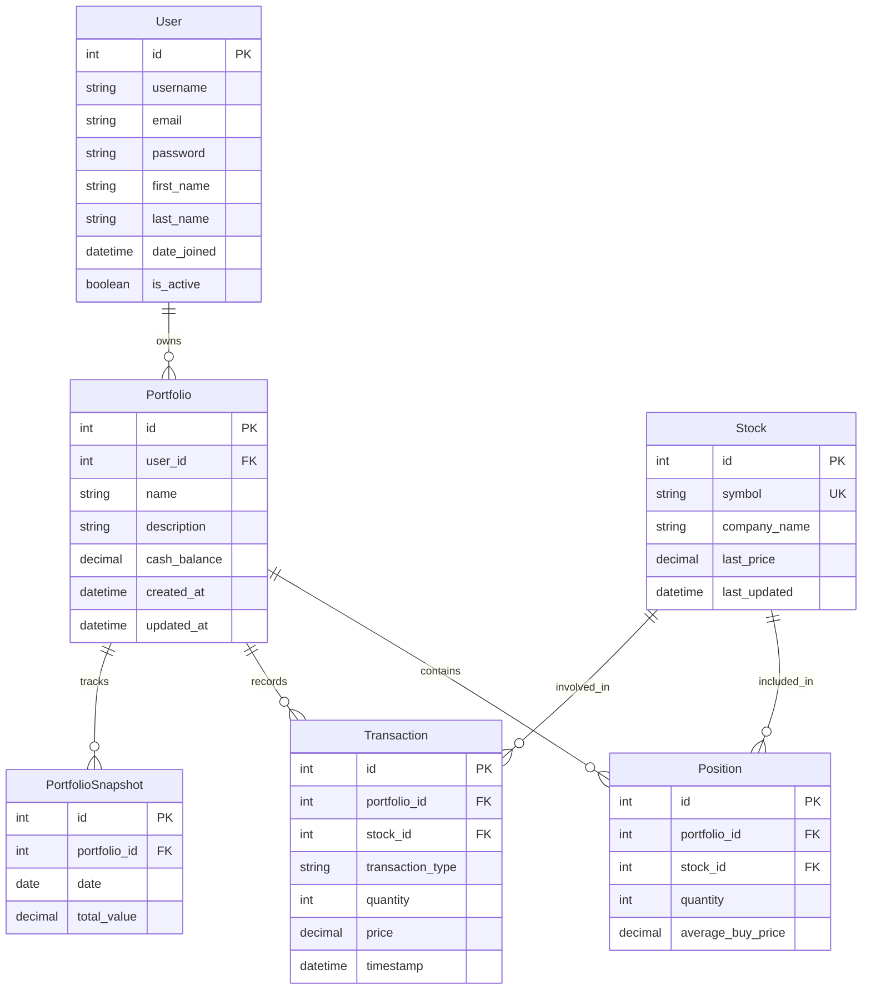

# Virtual Stock Trading API

A Django REST API that simulates stock trading with real-time market data. Users can create portfolios, buy/sell virtual stocks, and track their performance over time.

## Project Structure

```text
virtual_stock_trading_api/
├── manage.py
├── requirements.txt
├── .env
├── virtual_stock_trading_api/                   # Project settings
│   ├── __init__.py
│   ├── asgi.py
│   ├── settings.py
│   ├── urls.py
│   ├── wsgi.py
|   └── celery.py
├── accounts/                 # User authentication
│   ├── __init__.py
│   ├── admin.py
│   ├── apps.py
│   ├── migrations/
│   ├── models.py
│   ├── serializers.py
│   ├── urls.py
│   └── views.py
├── stocks/                   # Stock data and API integration
│   ├── __init__.py
│   ├── admin.py
│   ├── apps.py
│   ├── migrations/
│   ├── models.py
│   ├── serializers.py
│   ├── services.py           # Finnhub API client
│   ├── urls.py
│   └── views.py
├── portfolios/               # Portfolio management
│   ├── __init__.py
│   ├── admin.py
│   ├── apps.py
│   ├── migrations/
│   ├── models.py
│   ├── serializers.py
│   ├── tasks.py              # Celery tasks for snapshots
│   ├── urls.py
│   └── views.py
└── trading/                  # Trading operations
    ├── __init__.py
    ├── admin.py
    ├── apps.py
    ├── migrations/
    ├── serializers.py
    ├── urls.py
    └── views.py
```
<br>


## ERD DIAGRAM


<br>

## Features

- User authentication and portfolio management
- Real-time stock data via Finnhub API
- Buy/sell operations with transaction history
- Portfolio performance tracking
- RESTful API design with Django REST Framework

## Setup and Installation

1. Clone the repository
2. Create a virtual environment:

```python
python -m venv stock 
source stock/bin/activate
```
3. Install dependencies:
`pip install -r requirements.txt`

4. Set up environment variables:
```bash
# Create .env file in the project root
echo "SECRET_KEY=your_secret_key_here
FINNHUB_API_KEY=your_alpha_vantage_api_key
DEBUG=True" > .env
```

5. Run migrations:
```bash
python manage.py makemigrations
python manage.py migrate
```

6. Run the development server:
```bash
python manage.py runserver
```

<br>

__Authentication__

* The platform uses Django's built-in authentication system
* Token-based authentication for the API endpoints
* API requests must include an Authorization header with a valid token

## Testing with Postman
Here are the endpoints to test with Postman:

1. Register a user:

    * POST `/api/auth/register/`
    * Body: `{"username": "stockuser", "email": "stock@example.com", "password": "password123", "password2": "password123"}`

2. Login:
    * POST `/api/auth/login/`
    * Body: `{"username": "stockuser", "password": "password123"}`

3. Create a portfolio:
    * POST `/api/portfolios/`
    * Headers: `Authorization: Token <your_token>`
    * Body: `{"name": "My First Portfolio", "description": "Tech stocks", "cash_balance": 10000.00}`

4. Search for a stock:
    * POST `/api/stocks/search/`
    * Headers: `Authorization: Token <your_token>`
    * Body: `{"symbol": "AAPL"}`

5. Buy stock:
    * POST `/api/trading/buy/`
    * Headers: `Authorization: Token <your_token>`
    * Body: `{"portfolio_id": 1, "stock_symbol": "AAPL", "quantity": 5}`

6. View portfolio details:
* GET `/api/portfolios/1/`
* Headers: `Authorization: Token <your_token>`

7. Sell stock:
    * POST /api/trading/sell/
    * Headers: Authorization: Token <your_token>
    * Body: {"portfolio_id": 1, "stock_symbol": "AAPL", "quantity": 2}

8. View transactions:

    * GET `/api/portfolios/1/transactions/`
    * Headers: `Authorization: Token <your_token>`

9. Create a portfolio snapshot:

* POST `/api/portfolios/1/create_snapshot/`
* Headers: `Authorization: Token <your_token>`

10. View portfolio snapshots:

    * GET `/api/portfolios/1/snapshots/`
    * Headers: `Authorization: Token <your_token>`


__Deployment on Render__

1. Create a new account on Render

2. Create a new Web Service:
    * Connect your GitHub repository
    * Set the build command: `pip install -r requirements.txt`
    * Set the start command: `gunicorn virtual_stock_trading.wsgi:application`

3. Add environment variables:
    * `SECRET_KEY:` Your Django secret key
    * `FINNHUB_API_KEY:` Your Finnhub API key
    * `DEBUG`: Set to False for production
    * `ALLOWED_HOSTS`: Add your Render domain, e.g., your-app.onrender.com
    * `DATABASE_URL`: This will be automatically added if you use Render's PostgreSQL

4. Set up a PostgreSQL database:
    * Create a new PostgreSQL instance on Render
    * Link it to your web service

5. Deploy the application:
    * Render will automatically deploy your application
    * Monitor the deployment logs for any issues

### Technologies Used
* __Backend__: Django, Django REST Framework
* __Database:__ PostgreSQL
* __Stock Data:__ Finnhub API
* __Deployment__: Render


### Contributing
1. Fork the repository
2. Create your feature branch: git checkout -b feature/your-feature
3. Commit your changes: git commit -m 'Add your feature'
4. Push to the branch: git push origin feature/your-feature
5. Submit a pull request

### Acknowledgements
* Finnhub.io for providing stock market data
* Django and Django REST Framework
* Bootstrap for the UI components


